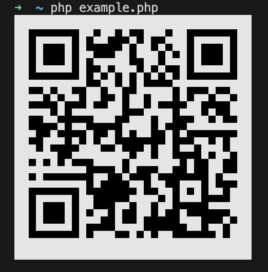
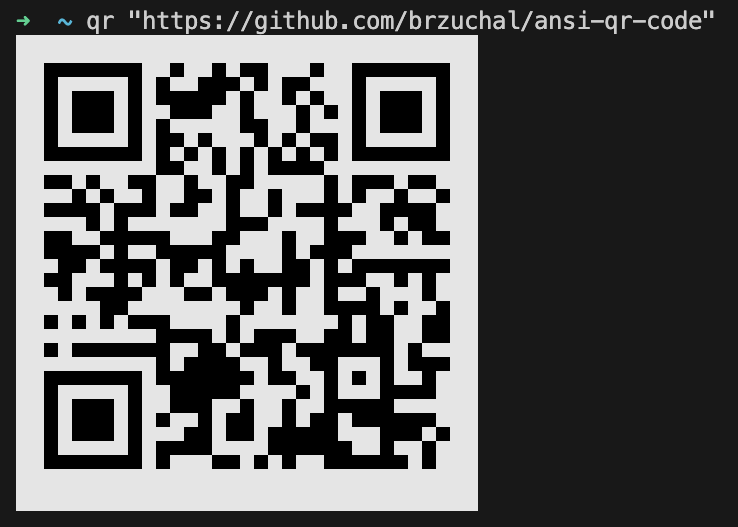

# ANSI QR Code

A PHP library for generating QR codes in the terminal using ANSI escape codes.




## Command Line Tool



## Features

*   **ANSI Renderer**: Uses half-block characters (`▀`, `▄`, `█`) and ANSI colors to render high-resolution QR codes in the terminal.
*   **ASCII Renderer**: Fallback renderer using full blocks (`██`) for wider compatibility.
*   **PHP 8.3 Support**: Fully compatible and tested with PHP 8.3.
*   **Static Analysis**: Strict type checking with PHPStan (max level).
*   **Coding Standard**: Adheres to `brzuchal/coding-standard`.

## Installation

```bash
composer require brzuchal/ansi-qr-code
```

## Installation

### One-liner (Recommended)

Installs the `qr` command to `~/.local/bin`.

```bash
curl -s https://raw.githubusercontent.com/brzuchal/ansi-qr-code/1.1/install.sh | bash
```

### Composer

```bash
composer global require brzuchal/ansi-qr-code
```

## Usage

### Command Line

After installing the package globally or in a project, you can use the `qr` command:

```bash
# If installed globally
qr "https://github.com/brzuchal/ansi-qr-code"

# If installed in a project
vendor/bin/qr "Your text here"
```

### PHP Code

```php
use Brzuchal\TerminalQr\TerminalQrCode;

$qr = new TerminalQrCode();

// Write directly to STDOUT
$qr->write('https://github.com/brzuchal/ansi-qr-code');

// Or get the rendered string
$output = $qr->render('https://github.com/brzuchal/ansi-qr-code');
echo $output;
```

### Customizing Renderer

You can choose between `AnsiRenderer` (default) and `AsciiRenderer`:

```php
use Brzuchal\TerminalQr\TerminalQrCode;
use Brzuchal\TerminalQr\Renderer\AsciiRenderer;

// Use ASCII renderer (full blocks)
$qr = new TerminalQrCode(new AsciiRenderer());
$qr->write('https://example.com');
```

## Requirements

*   PHP ^8.3
*   bacon/bacon-qr-code ^2.0

## License

MIT
